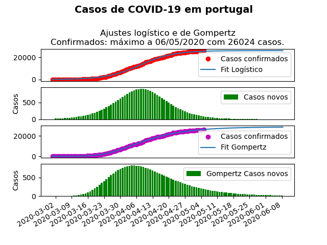

# COVID-19-Portugal

A small script to try and model the growth of the COVID-19 epidemic in Portugal using a logistic function (Not validated or trustworthy)

- Uses data from the excel file included, updating daily acording to DGS
- Makes a simple prediction acording to a logistic or error function

+In the process of implementing a more sophisticated prediction method.

## Disclaimer

All of this information does not have any kind of scientific validity whatsoever.
